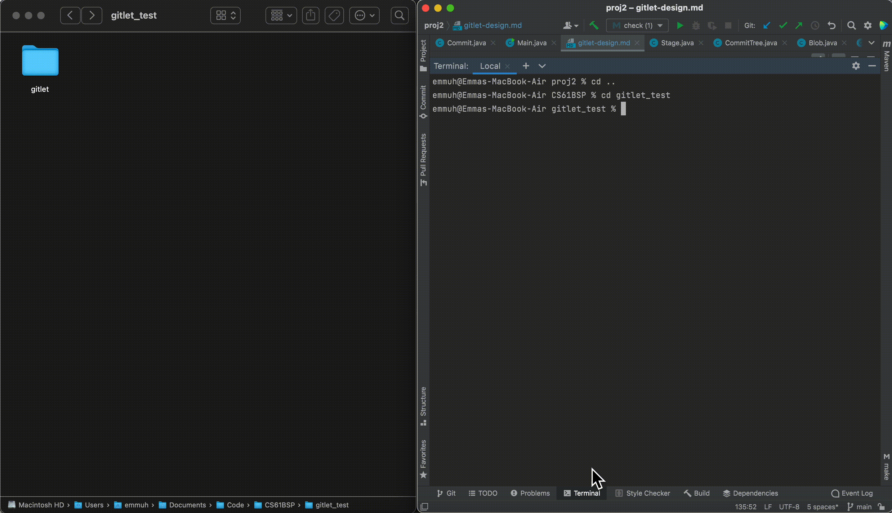

# GITLET

Gitlet is a local version control system designed, built and tested from scratch that implements Git features including init, commit, add/rm, status, merge, branch, log, checkout and reset.

The goal of this project is to get more familiar with File I/O in Java and using the Serializable interface, cryptographic hashing, graph traversals as well as designing with OOP principles to build easily maintanable code.

## INIT

## STATUS and ADD

## COMMIT 

## BRANCH

## MERGE and LOG

| File                                                                                    | Description                                                                                                                                                                                                                                      |
|-----------------------------------------------------------------------------------------|--------------------------------------------------------------------------------------------------------------------------------------------------------------------------------------------------------------------------------------------------|
| [Commit](https://github.com/Emma003/CS61BSP/blob/main/proj2/gitlet/Commit.java)         | Represents a commit and all its operations (saving, loading, adding files to the current working directory..). Uses a hashing algorithm to create a unique ID for each commit                                                                    |
| [CommitTree](https://github.com/Emma003/CS61BSP/blob/main/proj2/gitlet/CommitTree.java) | Handles log, checkout, branch and merge commands. Uses a breadth-first search on the commit tree to find split point after a branching event                                                                                                     |
| [Stage](https://github.com/Emma003/CS61BSP/blob/main/proj2/gitlet/Stage.java)           | Represents the addition/removal stage. Handles add, rm and status commands. Uses TreeMap and HashMap data structures to keep track of the staged files                                                                                           |
| Persistence                                                                             | The state of the files persist in an INDEX file that stores all info about the staging area. A HEAD file contains the path to the current branch. Branches, commits and blobs folder hold branch head IDs, commit IDs and blob IDs respectively. |

## Acknowledgements
Adapted from a project in UC Berkeley CS 61B Data Structures, Spring 2021, taught by Josh Hug.

